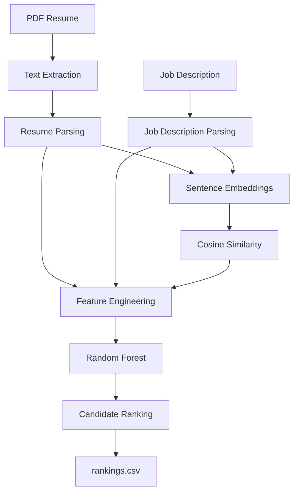

# Resume Screening Agent Using NLP and Machine Learning


## Project Overview

Recruiters and hiring teams often need to screen many PDF resumes against a specific job description. Manual review is slow, keyword-only screening is brittle, and pure semantic matching can miss important structured signals such as education, certifications, projects, and years of experience.

This project solves that problem with a local AI/ML pipeline that parses PDF resumes, extracts candidate attributes, computes NLP-based semantic similarity, engineers interpretable ranking features, trains a machine learning model, and outputs a ranked candidate list.

The goal is to demonstrate a production-quality terminal application for resume screening and ranking using NLP and machine learning. The expected outcome is `output/rankings.csv`, containing candidates sorted by predicted suitability for a selected job description.

## Key Highlights

- ✔ Resume Parsing
- ✔ NLP Semantic Matching
- ✔ Feature Engineering
- ✔ Random Forest Ranking
- ✔ Candidate Scoring
- ✔ Automated Testing
- ✔ CLI Interface
- ✔ Professional Documentation

## Table of Contents

- [Project Overview](#project-overview)
- [Key Highlights](#key-highlights)
- [Project Architecture](#project-architecture)
- [Folder Structure](#folder-structure)
- [Tech Stack](#tech-stack)
- [Installation](#installation)
- [First Time Setup](#first-time-setup)
- [Running the Project](#running-the-project)
- [Pipeline Explanation](#pipeline-explanation)
- [Machine Learning](#machine-learning)
- [Evaluation](#evaluation)
- [Example Output](#example-output)
- [Trade-offs](#trade-offs)
- [Future Improvements](#future-improvements)
- [License](#license)
- [Acknowledgements](#acknowledgements)

## Project Architecture



## Folder Structure

```text
resume-screening-ranking-system/
├── README.md
├── LICENSE
├── requirements.txt
├── requirements-lock.txt
├── pyproject.toml
├── main.py
├── predict_candidates.py
├── verify_features.py
├── Demo.ipynb
├── config.py
├── data/
│   ├── resumes/
│   ├── job_descriptions/
│   └── generated/
├── docs/
│   ├── architecture.md
│   ├── design_decisions.md
│   └── tradeoffs.md
├── models/
├── output/
├── parser/
├── nlp/
├── ml/
├── utils/
├── tests/
└── notebooks/
```

## Tech Stack

| Category | Tools |
| --- | --- |
| Language | Python 3.13 |
| Libraries | NumPy, Pandas, Joblib, tqdm |
| ML | scikit-learn, RandomForestRegressor |
| NLP | spaCy, Sentence Transformers, all-MiniLM-L6-v2 |
| Testing | pytest |
| Utilities | PyMuPDF, argparse, logging |

## Installation

```bash
git clone https://github.com/ak-Amaan/resume-screening-ranking-system.git
cd resume-screening-ranking-system
python3.13 -m venv .venv
source .venv/bin/activate
pip install -r requirements.txt
```

For exact reproducibility with the current development environment:

```bash
pip install -r requirements-lock.txt
```

## First Time Setup

The project uses the Sentence Transformer model `sentence-transformers/all-MiniLM-L6-v2` for semantic matching. On first execution, Sentence Transformers automatically downloads this model once to the local Hugging Face cache. The model is approximately 90 MB.

After the model is cached, the project runs completely offline from local files. No external APIs are used for parsing, scoring, training, or ranking. No resume data, job description data, or user data leaves the local machine.

## Running the Project

Train the Random Forest model and save `models/model.pkl`:

```bash
python main.py train
```

Rank all PDF resumes in `data/resumes/` against the default job description:

```bash
python main.py predict
```

Run a compact end-to-end demonstration:

```bash
python main.py demo
```

Verify feature vectors across all sample resumes and job descriptions:

```bash
python main.py verify
```

Run the complete automated test suite:

```bash
pytest
```

Use a specific job description:

```bash
python main.py predict --job-description data/job_descriptions/machine_learning_engineer.txt
```

## Pipeline Explanation

### Resume Parsing

PDF resumes are read with PyMuPDF. The parser extracts clean text across pages, then identifies candidate fields such as name, email, phone number, skills, education, certifications, projects, experience lines, and years of experience.

### Feature Extraction

Structured resume fields and parsed job description fields are converted into measurable candidate-job signals. These include skill overlap, education match, certification match, project relevance, programming language match, framework match, tools match, and years of experience difference.

### Semantic Similarity

The resume and job description are embedded using `sentence-transformers/all-MiniLM-L6-v2`. Cosine similarity is computed and clipped into the range `0.0` to `1.0`.

### Feature Engineering

The system combines semantic similarity with structured feature scores into a single pandas DataFrame. This feature vector is the input to the machine learning ranking model.

### Machine Learning

The Random Forest Regressor predicts a candidate suitability score from engineered features. It is trained on synthetic candidate-job samples generated locally.

### Candidate Ranking

The trained model predicts candidate scores, estimates confidence from Random Forest tree variance, sorts candidates in descending order, and writes the final ranking to `output/rankings.csv`.

## Machine Learning

Random Forest was selected because it performs well on tabular engineered features, handles non-linear interactions, trains quickly on a laptop, provides feature importances, and can be saved cleanly with Joblib.

Synthetic data was used because no labelled resume-ranking dataset was provided with the assessment. Instead of downloading external datasets, the project generates realistic candidate-job feature vectors programmatically and labels them with a transparent weighted formula:

```text
Candidate Score =
  0.40 * Semantic Similarity
+ 0.20 * Skill Match
+ 0.15 * Experience Match
+ 0.10 * Education Match
+ 0.05 * Certification Match
+ 0.05 * Programming Language Match
+ 0.03 * Framework Match
+ 0.02 * Tools Match
```

Scores are normalized to `0-100`.

## Evaluation

Latest model evaluation:

```text
MAE: 2.9248
RMSE: 3.7910
R² Score: 0.9405
5-Fold Cross Validation RMSE: 4.3016 +/- 0.4375
```

| Metric | Meaning |
| --- | --- |
| MAE | Mean Absolute Error; average absolute difference between predicted and target scores. Lower is better. |
| RMSE | Root Mean Squared Error; penalizes larger prediction errors more strongly. Lower is better. |
| R² | Proportion of target-score variance explained by the model. Higher is better. |
| Cross Validation | 5-fold validation estimates how stable model performance is across different train/test splits. |

## Example Output

```text
Candidate Rankings
 Rank Candidate Name  Similarity Score  Predicted Score
    1     Aisha Khan            0.6699            76.01
    2 Maria Gonzalez            0.5689            61.04
    3    Rohan Mehta            0.5275            54.43
    4     Nina Patel            0.4799            50.67
    5  Liam O'Connor            0.5665            47.41
```

Sample `output/rankings.csv`:

```csv
Rank,Candidate Name,Similarity Score,Predicted Score
1,Aisha Khan,0.6699,76.01
2,Maria Gonzalez,0.5689,61.04
3,Rohan Mehta,0.5275,54.43
4,Nina Patel,0.4799,50.67
5,Liam O'Connor,0.5665,47.41
```

## Trade-offs

### Advantages

- Fully local terminal workflow after first model download.
- Transparent feature engineering and scoring formula.
- No Kaggle or external resume datasets required.
- Interpretable Random Forest feature importances.
- Clear separation between parsing, NLP, feature engineering, training, and ranking.

### Limitations

- Synthetic labels are useful for assessment reproducibility but do not replace real hiring feedback.
- Regex and dictionary-based parsing may miss unusual resume layouts or uncommon skills.
- Scanned PDFs require OCR, which is not currently implemented.
- Embeddings are computed per resume-job pair rather than fully batched.

### Future Improvements

- Add OCR support for scanned resumes.
- Improve parsing for scanned resumes and complex multi-column layouts.
- Add batch embedding optimisation for large candidate pools.
- Compare more ranking models such as Gradient Boosting, XGBoost, or LightGBM.
- Fine-tune embeddings on resume and job description pairs.
- Add LLM-assisted parsing as an optional local or offline-compatible module.


## License

This project is licensed under the MIT License. See [LICENSE](LICENSE).

## Acknowledgements

This project uses and acknowledges:

- Sentence Transformers
- spaCy
- scikit-learn
- PyMuPDF
